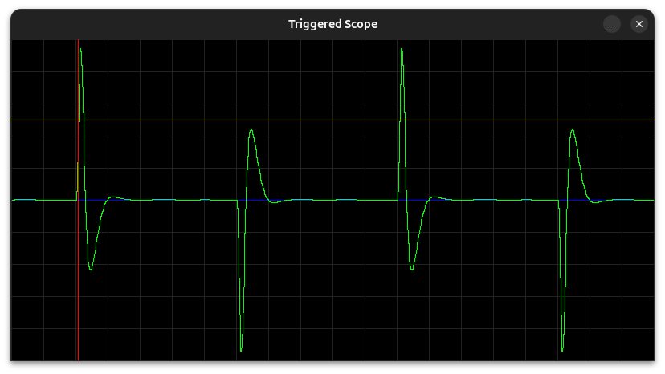

# CLModularSynth

**CLModularSynth** is a modular synthesizer toolkit written in C++. It includes command-line tools for generating control voltages (`cv`), producing voltage-controlled oscillator waveforms (`vco`), and visualizing waveforms in real-time (`scope`).

---

## 🛠 Dependencies

This project requires the following dependencies:

### 🧱 Runtime & Build

- **C++17 or higher**  
  Modern C++ standard for core language features.

- **SDL2**  
  Used by `scope` to render real-time waveform visualization.  
  Install it with your system package manager:

  - **Ubuntu/Debian**:
    ```bash
    sudo apt install libsdl2-dev
    ```
  - **macOS** (via Homebrew):
    ```bash
    brew install sdl2
    ```

  - **Windows**:
    Download from [https://libsdl.org](https://libsdl.org) or use with vcpkg:
    ```bash
    vcpkg install sdl2
    ```

### 🧩 Header-only Library

- **[argparse](https://github.com/p-ranav/argparse)**  
  A modern C++ header-only argument parser.  
  To use it, clone the repo or copy `argparse.hpp` into your `include/` directory.

  ```bash
  git clone https://github.com/p-ranav/argparse.gi
  ```

## Build Instructions

To build the project, use:

```bash
make
```

## Usage
```bash
./cv [--sampleRate VAR] [--amplitude VAR] [--duration VAR]
```
| Option          | Description              | Default |
| --------------- | ------------------------ | ------- |
| `--sampleRate`  | Sampling rate (Hz)       | 48000   |
| `--amplitude`   | Output amplitude         | 1       |
| `--duration`    | Duration in seconds      | 1       |
| `-h, --help`    | Show help message        |         |
| `-v, --version` | Show version information |         |


```bash
./vco [--sensitivity VAR] [--sampleRate VAR] [--amplitude VAR]
```
| Option          | Description                 | Default |
| --------------- | --------------------------- | ------- |
| `--sensitivity` | Control voltage sensitivity | 1       |
| `--sampleRate`  | Sampling rate (Hz)          | 48000   |
| `--amplitude`   | Output amplitude            | 1       |
| `-h, --help`    | Show help message           |         |
| `-v, --version` | Show version information    |         |

```bash
Filter [--help] [--version] [--filter_type VAR] --cutoff VAR [--rolloff VAR] [--sample_rate VAR]
```
| Option          | Description                                                 | Default   | Required |
| --------------- | ----------------------------------------------------------- | --------- | -------- |
| `-h, --help`    | Show help message and exit                                  | —         | No       |
| `-v, --version` | Print version information and exit                          | —         | No       |
| `--filter_type` | Type of filter: `lowpass` or `highpass`                     | `lowpass` | No       |
| `--cutoff`      | Cutoff frequency in Hz                                      | —         | **Yes**  |
| `--rolloff`     | Rolloff in dB/oct (must be a multiple of 6, e.g. 6, 12, 18) | `12`      | No       |
| `--sample_rate` | Sampling rate in Hz                                         | `48000`   | No       |

```bash
./scope [--horizontal_scale VAR] [--trigger] [--trigger_threshold VAR] [--trigger_offset VAR] [--buffer_size VAR] [--window_width VAR] [--window_height VAR]
```
| Option                   | Description                                    | Default |
| ------------------------ | ---------------------------------------------- | ------- |
| `--sample_rate`          | Time scale of the horizontal axis              | 48000   |
| `--trigger`              | Enable trigger mode                            |         |
| `--trigger_threshold`    | Trigger threshold level                        | 0.01    |
| `--trigger_offset`       | Samples to offset after trigger before display | 0       |
| `--window_width`         | Width of the display window (pixels)           | 800     |
| `--window_height`        | Height of the display window (pixels)          | 400     |
| `--voltage_per_division` | Y-Axis, value per division                     | 0.1     |
| `--voltage_divisions`    | Y-Axis, number of divisions                    | 10      |
| `--time_per_division`    | X-Axis, value per division                     | 0.001   |
| `--time_divisions`       | X-Axis, number of divisions                    | 10      |
| `-h, --help`             | Show help message                              |         |
| `-v, --version`          | Show version information                       |         |

## Exmaple
```bash
./bin/cv --duration 3 | ./bin/vco --wave_type square --sensitivity 100 | ./bin/filter --filter_type lowpass --cutoff 3000 --rolloff 12 --sample_rate 48000 | ./bin/filter --filter_type highpass --cutoff 1000 --rolloff 12 --sample_rate 48000 | ./bin/scope --sample_rate 48000 --trigger --trigger_offset 100 --trigger_threshold 0.5 --time_divisions 20 --time_per_division .001 --voltage_divisions 10 --voltage_per_division 0.2
```


